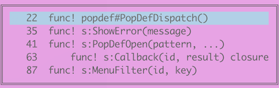

# popdef

Popdef is a Vim plugin that displays a list of function and class names in
the popup window. You can move to the selected line from the displayed
list. It is useful to get an overview of the source code.

By default, the following file types are supported: AsciiDoc, C, C++,
Python, Markdown, Vim.  File types not supported by default can be easily
added. See the description of Variables section in
[doc/popdef.txt](doc/popdef.txt) for details.

## Requirements

This plugin works with Vim 8.2 or later versions that support the popup window.

## Install

Place `autoload/popdef.vim` and `plugin/popdef.vim` as follows:

    ~/.vim/autoload/popdef.vim
    ~/.vim/plugin/popdef.vim

If you need a help file, place `doc/popdef.txt` as follows and run `:helptags doc`:

    ~/.vim/doc/popdef.txt

This plugin is invoked with the command `:PopDef`. To assign the execution of
this command to a keymap, for example, set the following in ~/.vimrc:

    nnoremap <silent> <Leader>d :PopDef<CR>

## Key Mapping

- j: `<count>` line downward
- k: `<count>` line upward
- H: Line `<count>` from top of window
- M: Middle line of window
- L: Line `<count>` from bottom of window
- CTRL-F: Page down
- CTRL-B: Page up
- gg: Go to first line
- G: Goto line `<count>`, default last line
- /: Enter search mode
- n: Search forward
- N: Search backward
